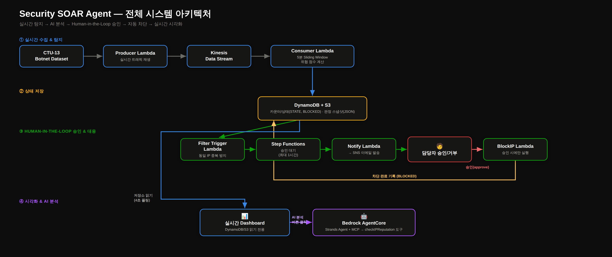
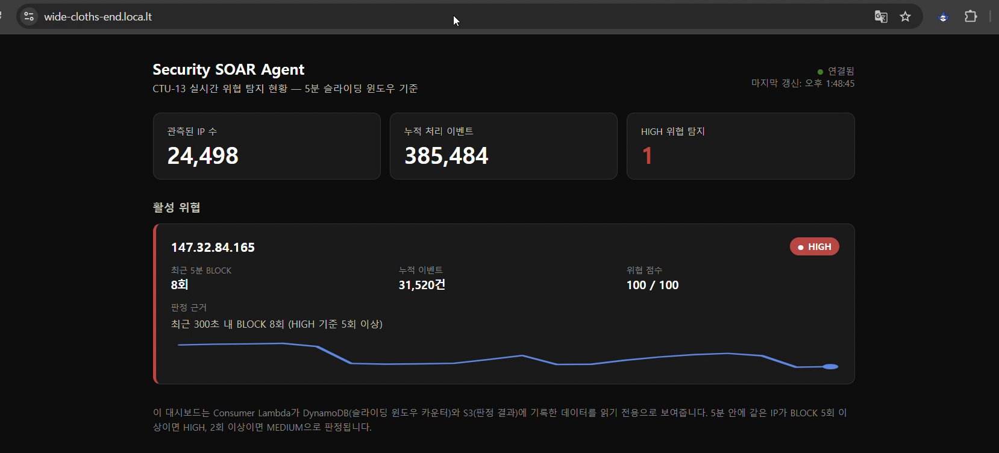
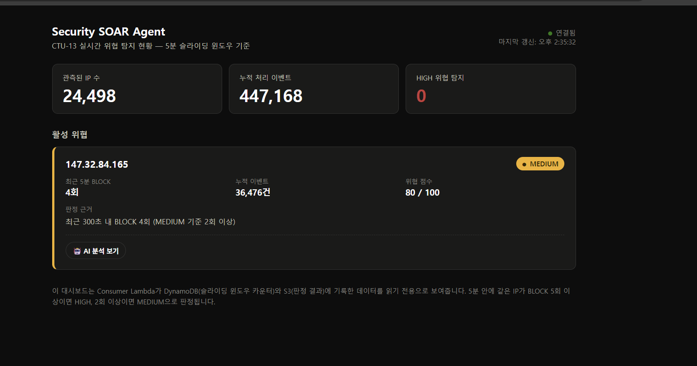

# Security SOAR Agent (team soara)

실시간 위협 탐지 → AI 기반 분석 → Human-in-the-Loop 승인 → 자동 차단까지 이어지는
AWS 서버리스 SOAR(Security Orchestration, Automation and Response) 파이프라인입니다.

> ⏱️ **해커톤 단기간 프로젝트임을 밝힙니다.** 이 프로젝트는 정해진 해커톤 기간 동안
> 빠르게 기획·구현·검증까지 진행한 결과물입니다. 그래서 프로덕션 수준의 완성도보다는
> "핵심 아이디어(설명 가능한 탐지 + Human-in-the-Loop + AI 분석)가 실제로 동작하는가"를
> 증명하는 데 집중했고, 코드 곳곳에 다듬어지지 않은 부분이나 임시방편으로 우회한 구간이
> 남아 있습니다(자세한 내용은 하단 [한계 및 향후 개선 방향](#한계-및-향후-개선-방향) 참고).

## 발표 자료

- 📑 [발표 슬라이드 (Canva)](https://www.canva.com/design/DAHSJjueHX4/f4-Ip0-lRb488WPh7s_vIw/edit)
- 📝 [발표 대본](partA_A2/demo_script.md)

## 왜 만들었나

보안 관제 담당자는 하루에도 수천 건의 이벤트를 마주하지만, 단순 탐지만으로는 신뢰하고
대응하기 어렵습니다. 이 프로젝트는 세 가지를 동시에 달성하려고 합니다.

- **설명 가능한 탐지**: 규칙 기반 점수 + Bedrock AgentCore AI 에이전트의 자연어 판단 근거
- **사람이 통제하는 자동화**: 탐지는 자동, 실제 차단은 반드시 사람의 승인을 거침
- **실시간 가시성**: 탐지부터 승인, 차단까지 전 과정을 대시보드에서 확인

## 전체 흐름

CTU-13 봇넷 트래픽 데이터셋을 Kinesis로 스트리밍 → Consumer Lambda가 5분 슬라이딩
윈도우로 위협 점수를 계산해 DynamoDB/S3에 기록 → HIGH 판정 시 Step Functions가 담당자
승인을 대기(waitForTaskToken) → SNS로 승인 요청 이메일 발송 → 승인 시 BlockIP Lambda가
실제 차단을 실행하고 결과를 다시 기록 → 대시보드가 이 모든 과정을 실시간으로 시각화하며,
Bedrock AgentCore 기반 AI 에이전트가 온디맨드로 심층 판단 근거를 제공합니다.

## 테스트 화면 및 영상

**HIGH 등급 탐지 — 판정 근거 자동 표시**

**MEDIUM 등급 + AI 분석 버튼**

**데모 영상**: (링크 추가 예정 — 녹화한 시연 영상을 유튜브(비공개/일부공개)나 구글 드라이브에
업로드한 뒤, 이 자리에 링크를 넣어주세요. 예: `[데모 영상 보기](영상-URL)`)

## 폴더 구조

- `partA_A2/` — 데이터 전처리, Producer/Consumer Lambda, Human-in-the-Loop 승인 플로우,
  실시간 대시보드(+ AI 분석 연동), 아키텍처 다이어그램, 발표 대본, 회고
- `partB/` — 인프라 프로비저닝(Kinesis, DynamoDB, S3, SNS/SQS, Cognito, Step Functions),
  AgentCore 연동 지원 자료
- `partC/` — Step Functions 기반 Human-in-the-Loop 승인 처리 단계별 구현(스켈레톤 → 실제
  구현까지)

## 주요 컴포넌트

| 구성 요소 | 역할 |
|---|---|
| Producer Lambda | CTU-13 데이터셋을 실시간처럼 Kinesis로 재생 |
| Consumer Lambda | 5분 슬라이딩 윈도우 기반 IP별 위협 점수 계산 (LOW/MEDIUM/HIGH) |
| Filter Trigger Lambda | S3 신규 판정 파일 감지, 동일 IP 중복 승인 요청 방지 |
| Step Functions | `waitForTaskToken` 패턴으로 사람의 승인을 최대 1시간 대기 |
| Notify / Respond Lambda | SNS 이메일 발송, 승인/거부 콜백 처리 |
| BlockIP Lambda | 승인된 IP만 실제 차단 실행 + DynamoDB에 기록 |
| Dashboard | DynamoDB/S3를 읽기 전용으로 폴링하는 실시간 대시보드 |
| Bedrock AgentCore (Strands Agent + MCP) | 온디맨드 호출 시 위협 조회 도구를 사용해 자연어 판단 근거 제공. 절대 스스로 차단을 실행하지 않음 |

## 참고 자료

- [느낀 점 및 경험한 성과](partA_A2/reflection.md)

## 한계 및 향후 개선 방향

짧은 해커톤 기간 안에 만들다 보니 명확한 한계가 있습니다. 검증은 CTU-13 단일 데이터셋으로만
진행했고, AI 에이전트 호출도 자동이 아닌 수동 버튼 방식입니다. 또한 이번 AWS 환경(계정 차원의
공개 Lambda 호출 제약)에 맞춰 대시보드를 인증된 세션에서 직접 서빙하는 방식(로컬 서버 +
터널링)으로 우회했는데, 실제 운영 환경에서는 정식 공개 배포 구조(API Gateway + 적절한 인증,
또는 별도 계정)로 바꿔야 합니다. 앞으로는 다양한 공격 유형 데이터로 검증 범위를 넓히고, 승인
채널도 이메일 외에 Slack 등으로 확장할 계획입니다.

## 보안 유의사항

이 저장소의 스크립트는 특정 AWS 계정/리전(ap-northeast-2)을 기준으로 작성되었습니다.
실제 자격 증명(Access Key, Client Secret 등)은 코드에 하드코딩되어 있지 않고 전부
환경 변수로 주입하도록 되어 있습니다. 이 저장소를 포크/재사용할 경우 각자의 AWS
계정 정보로 교체해서 사용하세요.
